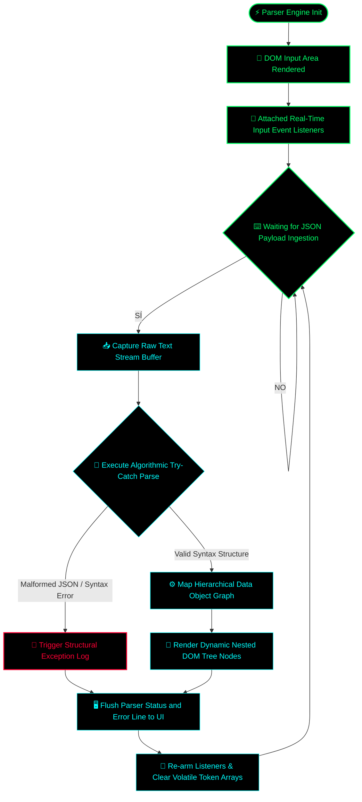

# JSON Structure Parser & Analytics Engine 📑

A low-latency data structure validator and hierarchical tokenization engine built in native JavaScript. This repository demonstrates optimized abstract syntax tree (AST) simulation, real-time object graph parsing, and deterministic syntax error isolation with zero processing lag.

## 🗂️ Architectural Overview

The analytics engine operates as an isolated syntax compiler, capturing raw JSON input streams, executing dynamic string validation, and tracking structural nesting levels through a modular token-matching pipeline.

### ⚙️ Core Technical Features:
* **Real-Time Tokenization:** Parses and expands object keys and data types instantly via synchronized execution loops.
* **Syntax Exception Isolation:** pinpoints formatting anomalies and trailing token bugs to protect the calculation stack.
* **Zero External Dependencies:** Built strictly with vanilla JavaScript, CSS, and HTML for direct hardware thread alignment.

## 🚀 Deployment Instructions

To run the JSON parser engine locally or host it on any web environment:
1. Clone this repository to your local storage.
2. Ensure `index.html`, `style.css`, and `script.js` are in the same directory.
3. Open `index.html` in any standard modern web browser (Chrome, Brave, Edge).

*Developed for structured data serialization analysis and core parsing logic prototyping.*

